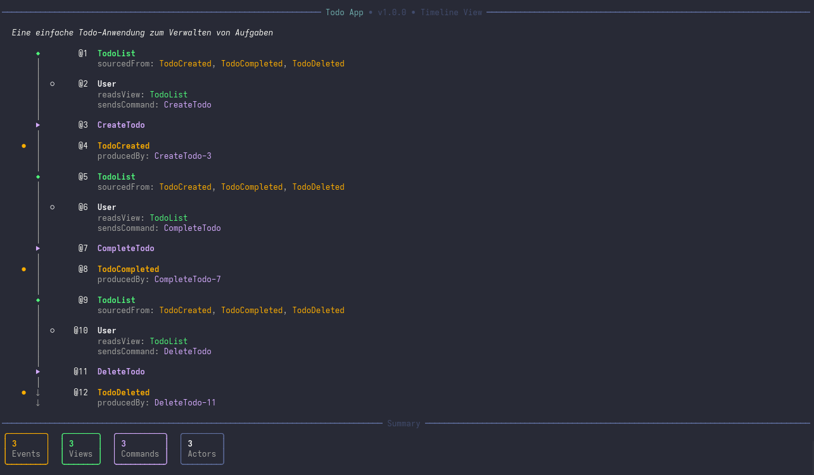
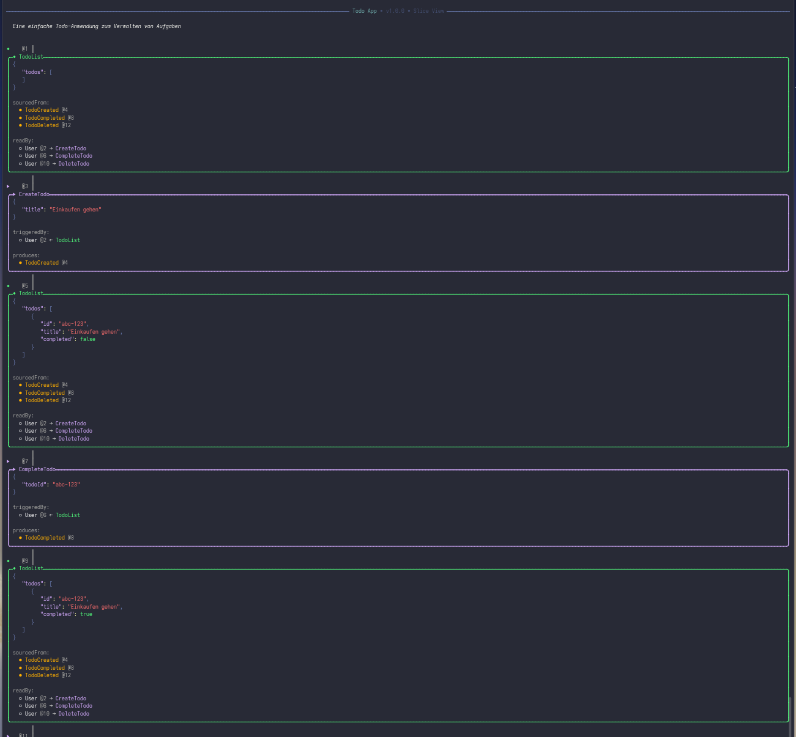
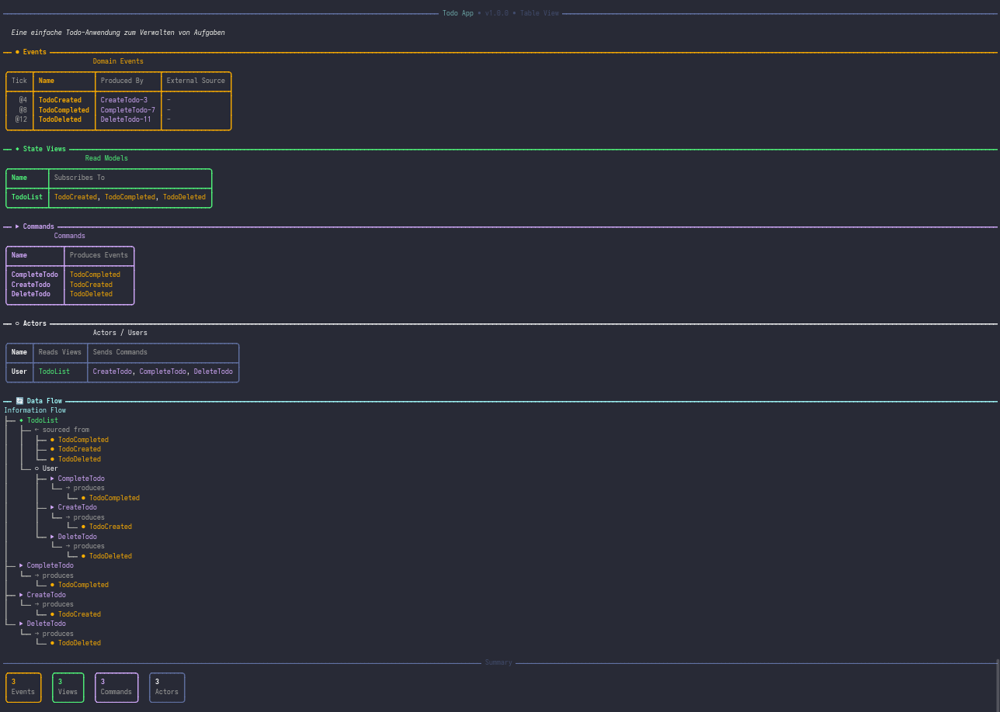

# Event Modeling File Format

A human-readable JSON format for describing event-driven systems using [Event Modeling](https://eventmodeling.org/).

---

## 1. Why

Event Modeling is a powerful methodology for designing software systems. But where do you store the model?

**The Problem:**
- Proprietary tools lock your designs into their platforms
- Visual-only formats can't be version controlled meaningfully

**The Solution:**
A simple, human-readable JSON format that:
-  Can be checked into Git alongside your code
-  Is easy to read and manually edit
-  Follows the natural flow of Event Modeling (Timeline → Events → Views → Commands)
-  Supports tooling while remaining tool-agnostic

---

## 2. Philosophy

- **Event Modeling is a continuous process.**  
  The format must allow incomplete systems to be saved. The format itself should allow invalid models.

- **Validation belongs in tools, not the format.**  
  The file specification stays simple. Applications derive insights and validates.

- **No Slices in the file.**  
  Slices are implementation/project management concerns. They belong in a separate view, not the design file.

- **Human-readable above all.**  
  The file should be transparent - something you can check in, diff, and manually correct.

- **GWTs are separate.**  
  Given-When-Then scenarios are alternative timelines. They don't belong on the main timeline.

---

## 3. Simple Example

A minimal event model showing the core flow: **Event → StateView → Actor → Command → Event**

```json
{
  "$schema": "./event-modeling.schema.json",
  "name": "Simple Order Flow",
  "version": "1.0.0",
  "timeline": [
    {
      "type": "event",
      "name": "OrderPlaced",
      "tick": 10,
      "example": {
        "orderId": "ord-123",
        "customerId": "cust-456",
        "amount": 99.99
      }
    },
    {
      "type": "stateview",
      "name": "PendingOrders",
      "tick": 20,
      "subscribesTo": ["OrderPlaced", "OrderShipped"],
      "example": {
        "orders": [
          { "orderId": "ord-123", "status": "pending", "amount": 99.99 }
        ]
      }
    },
    {
      "type": "actor",
      "name": "WarehouseWorker",
      "tick": 30,
      "readsView": "PendingOrders",
      "sendsCommand": "ShipOrder"
    },
    {
      "type": "command",
      "name": "ShipOrder",
      "tick": 40,
      "example": {
        "orderId": "ord-123",
        "trackingNumber": "DHL-789",
        "carrier": "DHL"
      }
    },
    {
      "type": "event",
      "name": "OrderShipped",
      "tick": 50,
      "producedBy": "ShipOrder-40",
      "example": {
        "orderId": "ord-123",
        "trackingNumber": "DHL-789",
        "shippedAt": "2024-01-15T14:30:00Z"
      }
    }
  ]
}
```

### Timeline Elements

| Type | Symbol | Naming | Description |
|------|--------|--------|-------------|
| `event` | ● | Past tense (`OrderShipped`) | Something that happened |
| `stateview` | ◆ | Noun (`PendingOrders`) | Read model built from events |
| `actor` | ○ | Role (`WarehouseWorker`) | Who reads views and sends commands |
| `command` | ▶ | Imperative (`ShipOrder`) | Intent to do something |

### The `tick` Property

The `tick` determines position on the timeline. Elements display in ascending order. Gaps between ticks create visual spacing in the output.


---

## 4. Challenges

There are still some challenges to be solved. I will write more about them soon.


---

## 4. EM Analyzer

The **EM Analyzer** (`ema`) is a CLI tool to visualize `.eventmodel.json` files.

### Installation

```bash
git clone https://github.com/your-org/event-modeling-file-format.git
cd event-modeling-file-format
dotnet build
```

### Usage

```bash
dotnet run --project src/EventModelAnalyzer -- <file> [options]
```

### Options

| Option | Description |
|--------|-------------|
| `-v, --view <mode>` | Display mode (see below) |
| `-e, --example` | Show example data in output |
| `-o, --output <file>` | Export output to a text file (without header) |
| `-s, --schema <path>` | Validate against JSON schema first |
| `-h, --help` | Show help |

### View Modes

| Mode | Best For | Description |
|------|----------|-------------|
| `timeline` | Quick overview | Vertical chronological view with symbols |
| `slice` | Detailed analysis | Panels with JSON examples and relationships |
| `table` | Documentation | Tables per type with data flow tree |

### Examples

```bash
# Interactive mode - prompts for view selection
dotnet run --project src/EventModelAnalyzer -- model.eventmodel.json

# Timeline view with example data
dotnet run --project src/EventModelAnalyzer -- model.eventmodel.json -v timeline -e

# Table view for documentation
dotnet run --project src/EventModelAnalyzer -- model.eventmodel.json -v table

# Export to file (header excluded from file)
dotnet run --project src/EventModelAnalyzer -- model.eventmodel.json -v timeline -e -o output.txt

# Validate against schema first
dotnet run --project src/EventModelAnalyzer -- model.eventmodel.json -s event-modeling.schema.json -v timeline
```

### Output Example (Timeline)

```
    ●  │       @10  OrderPlaced
       │            {
       │              "orderId": "ord-123",
       │              "customerId": "cust-456"
       │            }
       │
       ◆       @20  PendingOrders
       │            subscribesTo: OrderPlaced, OrderShipped
       │
       │  ○    @30  WarehouseWorker
       │            readsView: PendingOrders
       │            sendsCommand: ShipOrder
       │
       ▶       @40  ShipOrder
       │
    ●  │       @50  OrderShipped
       │            producedBy: ShipOrder-40
```

### Screenshots

**Timeline View**



**Timeline View with Example Data**


**Slice View**



**Table View**



---

## 5. Event Modeling Toolkit Converter

The **EMT Converter** converts other Event Modeling formats into the `.eventmodel.json` format.

### Supported Formats

- **Miro Event Modeling Toolkit** - Export from Martin Dilgers tool available on miro (https://www.nebulit.de/en/eventmodeling-tooling)

### Usage

```bash
dotnet run --project src/EventModelingToolkit.Converter -- <input-file> [options]
```

### Options

| Option | Description |
|--------|-------------|
| `-i, --input <file>` | Input file path |
| `-o, --output <file>` | Output file (default: `<input>.eventmodel.json`) |
| `-n, --name <name>` | Model name (default: filename) |
| `-q, --quiet` | Suppress conversion report |
| `-h, --help` | Show help |

### Examples

```bash
# Basic conversion
dotnet run --project src/EventModelingToolkit.Converter -- dilger-export.json

# With custom output and name
dotnet run --project src/EventModelingToolkit.Converter -- dilger-export.json -o my-model.eventmodel.json -n "My System"
```

### Conversion Report

The converter outputs a detailed report showing:
- Number of converted elements (Events, Commands, StateViews, Actors)
- Skipped elements (Screens, Processors)
- Warnings about elements that couldn't be fully converted

---
